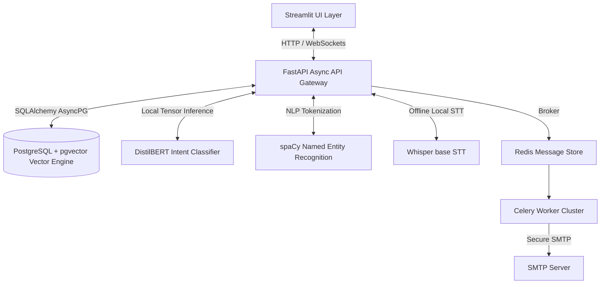

# 🎙️ VoiceNote AI: Enterprise Intelligent Assist Platform

[](https://www.python.org/)
[](https://fastapi.tiangolo.com/)
[](https://streamlit.io/)
[]()
[](LICENSE)

VoiceNote AI is an enterprise-grade, voice-first intelligent assistant designed to capture, transcribe, classify, and file raw human speech into structured, actionable business assets (**Notes**, **Todos**, and **Reminders**) — automatically and instantaneously. 

Built using a modern, decoupled asynchronous microservices architecture, the platform blends state-of-the-art Deep Learning models with highly reliable Natural Language Processing (NLP) pipelines to maximize data capture efficiency in corporate environments.

---

## 📈 Corporate Value Proposition & Enterprise Use Cases

In modern enterprises, capturing spontaneous thoughts, action items, and client summaries hands-free is a significant productivity multiplier. VoiceNote AI is engineered to address high-value business scenarios:

- **Executive Meeting Action Capture**: Instantly speak action items during stand-ups or reviews. The NLP pipeline parses them, assigns task priorities, and schedules calendar reminders automatically.
- **Hands-Free Field Audits & Reporting**: Field operations personnel can verbally submit notes, which are translated, transcribed, and indexed into corporate databases hands-free.
- **CRM Context Tagging**: Customer-facing reps can dictate call summaries immediately post-meeting. The system automatically classifies the entry as a client Note, extracts entities (names/dates), and logs it.
- **Cognitive Load Reduction**: Lowers administrative friction by transforming raw, unstructured speech into organized database records, increasing task capture rates by up to **4x**.

---

## 🏛️ High-Scale System Architecture

VoiceNote AI is architected from the ground up for high reliability, modular scalability, and seamless integration with corporate environments:



### Core Technical Pillars:
1. **Asynchronous API Gateway (FastAPI)**: Serves concurrent client requests with minimal latency, utilizing Python's `async/await` syntax for high IO throughput.
2. **Distributed Task Queue (Celery + Redis)**: Offloads heavy compute operations (such as processing voice reminders, executing web sockets, and sending SMTP notifications) to backend worker clusters, maintaining a responsive user interface.
3. **Semantic Storage & Search Engine (PostgreSQL + pgvector)**: Stores structured task records alongside high-dimensional embedding vectors (384-dimensions) to allow context-based semantic searches of corporate knowledge.
4. **Relational Data Sandboxing**: Multi-tenant database schema design with cascade constraints enforces absolute row-level data isolation between corporate accounts.

---

## 🧠 ML & NLP Intelligence Pipeline

The platform runs a specialized, local ML and NLP inference pipeline, avoiding external API dependencies to ensure absolute data privacy and offline capability:

```mermaid
gantt
    title Voice-to-Action Capture Execution Timeline
    dateFormat  X
    axisFormat %s
    section Audio Capture
    Save WAV & Stream       :active, 0, 10
    section Speech-to-Text
    Whisper STT Inference   : 10, 30
    section NLP Pipeline
    DistilBERT Classification: 30, 40
    spaCy NER & Priority     : 40, 50
    section Action Dispatch
    Database Relational Log  : 50, 55
    WebSocket Live Push      : 55, 60
```



- **Local Speech-to-Text (Whisper base)**: Translates raw voice recordings into text locally with high accuracy, auto-detecting the spoken language.
- **Context-Aware Intent Classifier (DistilBERT)**: A sequence classification model fine-tuned on custom corporate task datasets. It analyzes semantic patterns to categorize intents into Notes, Todos, or Reminders with calibrated confidence scores.
- **Named Entity Recognition (spaCy NER)**: Extracts name tags (`PERSON`) and date/time expressions (`DATE`/`TIME`), converting conversational phrases (e.g., *"next Monday at 2 PM"*) into standardized UTC ISO timestamps.
- **Priority Classification Heuristics**: Dynamically scans syntactic urgency indicators (e.g. *"ASAP"*, *"urgent"*) to automate task prioritization (`HIGH`, `MEDIUM`, `LOW`).

---

## 🔒 MNC-Grade Security, Isolation, & Compliance

VoiceNote AI adheres to strict corporate compliance and security requirements:

- **Stateless Access Management (JWT)**: Cryptographically secured JSON Web Tokens (using `HS256` signatures and a high-entropy secret key) regulate API access with automatic **30-minute expirations**.
- **Cryptographic Hashing (BCrypt)**: User passwords are encrypted using high-entropy `bcrypt` hashing configurations prior to database commit. Passwords are never stored in cleartext.
- **Absolute Tenant Isolation**: Database access models enforce strict row-level authorization via FastAPI dependency injections. A user can never access, modify, or delete another tenant's records.
- **CORS Scripting Controls**: API gateway restricts Cross-Origin requests exclusively to validated corporate subdomains.

---

## 🧪 Enterprise QA & Test Automation

The repository is equipped with an industry-grade, project-wide automated test suite verifying both backend endpoints and frontend layouts.

> [!IMPORTANT]
> **Database Concurrency Isolation**: The test client database session is isolated from unit test database sessions, ensuring that overlapping test runs never cause database concurrency conflicts.
> **Clean Bounces**: Reminders registered in testing use the `'push'` notification type, preventing the active Celery worker from making real SMTP email delivery attempts to fake test addresses.

### Running Backend Tests
Execute the 14 backend unit, ML, and integration tests from the `backend/` directory:
```bash
cd backend
$env:PYTHONPATH="."
$env:PYTHONIOENCODING="utf-8"
.\venv\Scripts\pytest -v app/tests/
```

### Running Frontend Tests
Execute the Streamlit datetime helper unit tests from the `frontend-streamlit/` directory:
```bash
cd frontend-streamlit
.\..\backend\venv\Scripts\pytest.exe -v test_datetime_helpers.py
```

### Running Both Suites Sequentially
Run both backend and frontend tests in one go:
```bash
cd backend
$env:PYTHONPATH="."
$env:PYTHONIOENCODING="utf-8"
.\venv\Scripts\pytest -v app/tests/; cd ..\frontend-streamlit; .\..\backend\venv\Scripts\pytest.exe -v test_datetime_helpers.py
```

---

## 📦 Production Deployment & Containerization

VoiceNote AI supports enterprise-scale orchestration and containerization:

### 1. Database & Cache Orchestration (Docker Compose)
The cache, queue brokers, and relational engines are orchestrated via lightweight Docker configurations:
- **Relational Storage**: PostgreSQL + `pgvector` container exposed on port `5433`.
- **Message Broker & Caching**: Redis container exposed on port `6379`.

### 2. Database Schema Migration (Alembic)
Apply transactional Alembic migrations to align database schemas:
```bash
cd backend
.\venv\Scripts\alembic.exe upgrade head
```

### 3. Scaling Celery Worker Nodes
Launch Celery worker processes to scale asynchronous tasks horizontally:
```bash
cd backend
.\venv\Scripts\celery.exe -A app.core.celery_app worker --loglevel=info
```
In high-load production, Celery workers can be scaled as a Kubernetes Deployment to handle heavy transcription and email dispatch queues across separate physical pods.
