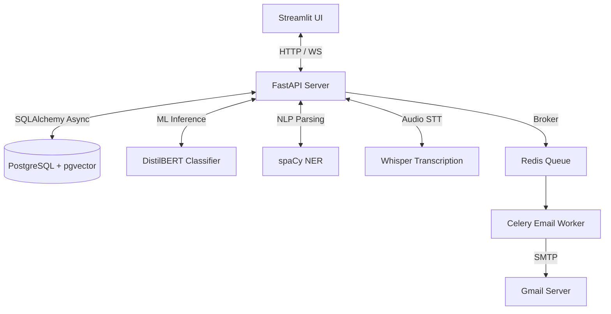

# VoiceNote AI: System Architecture

This document provides a technical overview of the system architecture of VoiceNote AI.

---

## 🏛️ High-Level System Design

VoiceNote AI utilizes a decoupled, modern three-tier architecture:
1. **Frontend Presentation Layer**: A dynamic, responsive Streamlit dashboard.
2. **Backend Application Layer**: An asynchronous FastAPI REST API server incorporating core service classes for NLP, machine learning inference, and database interactions.
3. **Data & Queue Persistence Layer**:
   - **PostgreSQL**: Stores relational user and task metadata (utilizes `pgvector` for ML semantic embedding indexing).
   - **Redis**: Serves as the caching backend and message broker.
   - **Celery**: Executes background tasks such as email reminder schedules.

---

## 🔄 Core Data & Operations Flow

### Voice Capture & Intent Pipelines
1. **Voice Input Capture**: The user records their voice on the Streamlit dashboard. The audio file is submitted to the `/voice-create` endpoint.
2. **Transcription (Speech-to-Text)**: FastAPI saves the audio file temporarily and calls `TranscriptionService` (utilizing Whisper base model) to transcribe speech to text.
3. **Classification (DistilBERT Intent Engine)**: The transcript is fed to the fine-tuned DistilBERT Sequence Classifier model to predict the category intent (`note`, `todo`, or `reminder`).
4. **Entity Extraction (spaCy NLP Engine)**: The transcript is parsed by spaCy's `en_core_web_sm` model to extract names (labeled `PERSON`) and dates/times (labeled `DATE`/`TIME`).
5. **Target Action Creation**:
   - **Note**: Created directly with text contents, confidence score, and language parameters.
   - **Todo**: Created as a task, setting a priority parsed by spaCy (`HIGH`, `MEDIUM`, or `LOW`).
   - **Reminder**: Parsed to extract target future alert times, scheduling database alerts.
6. **Unified Sync**: The created entity ID, type, and transcript parameters are returned to the user in a JSON payload.

---

## 📁 Database Schema Design

The system implements clean relational schemas with proper foreign key cascading:

### 1. `User` Model
- `id`: Primary UUID.
- `email`: Unique email string.
- `hashed_password`: Stored as bcrypt password hash.
- `full_name`: Name string.
- `is_active`: Boolean flag.

### 2. `Note` Model
- `id`: Primary UUID.
- `user_id`: Cascading Foreign Key referencing `users.id`.
- `title`: Short string title or summary.
- `content`: Text contents of transcript.
- `original_language`: Language identifier (e.g. `en`, `es`).
- `content_type`: Enum string (`note`, `todo`, `reminder`).
- `classification_confidence`: Float value.
- `embedding`: Vector object (384 float dimensions) for semantic semantic searches.

### 3. `Todo` Model
- `id`: Primary UUID.
- `user_id`: Foreign Key referencing `users.id`.
- `title`: Task text.
- `priority`: Enum string (`HIGH`, `MEDIUM`, `LOW`).
- `status`: Enum string (`PENDING`, `COMPLETED`).
- `completed_at`: Nullable timezone-aware timestamp.

### 4. `Reminder` Model
- `id`: Primary UUID.
- `user_id`: Foreign Key referencing `users.id`.
- `reminder_time`: Target timezone-aware alert timestamp in UTC.
- `notification_type`: Enum string (`email`, `push`, `both`).
- `is_sent`: Boolean tracking dispatch status.
